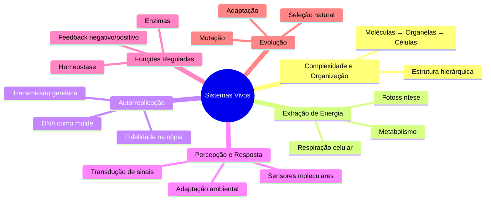
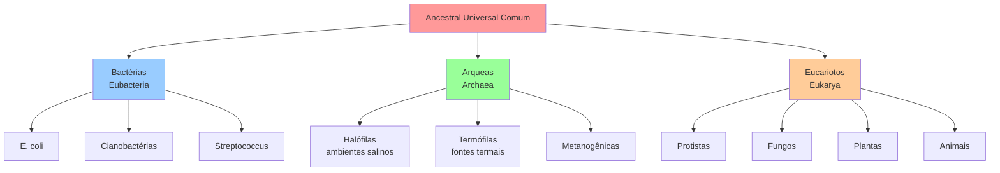
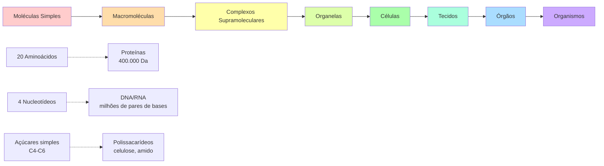
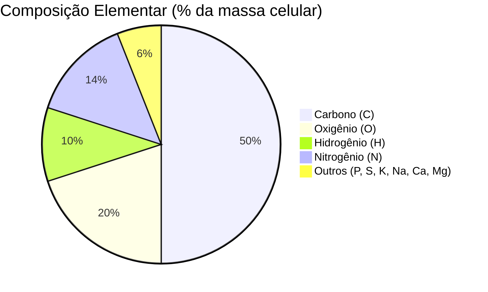
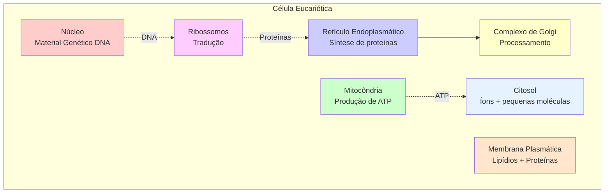
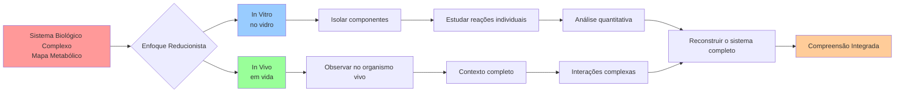
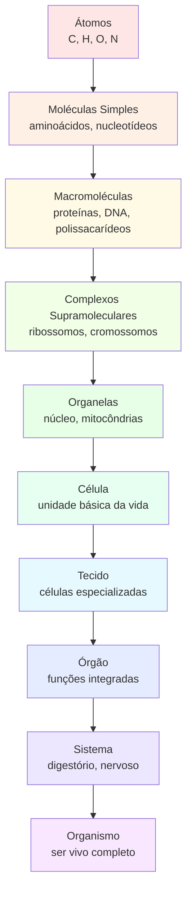
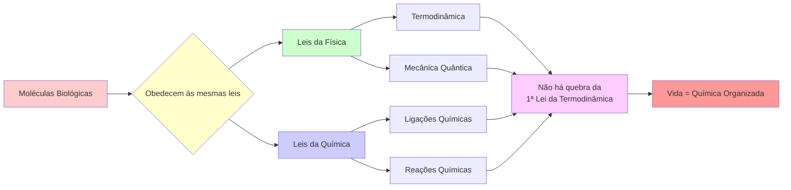

# 📊 Esquemas Visuais - Aula 01: Fundamentos Básicos de Sistemas Biológicos

## 1. Características dos Sistemas Vivos



---

## 2. Os Três Domínios da Vida



---

## 3. Dualidade: Complexidade Estrutural vs. Simplicidade Molecular



---

## 4. Composição Elementar da Vida



---

## 5. Estrutura Básica de uma Célula Eucariótica



---

## 6. Abordagens de Estudo em Bioquímica



---

## 7. Fluxo: Da Molécula ao Organismo



---

## 8. Princípio Fundamental da Bioquímica



---

## Instruções para Visualização

Estes diagramas estão em formato **Mermaid**, que pode ser renderizado em:
- GitHub (suporte nativo)
- VS Code (com extensão Mermaid)
- Ferramentas online: [Mermaid Live Editor](https://mermaid.live/)

Para gerar imagens PNG, use o comando:
```bash
manus-render-diagram esquemas_aula01.md esquemas_aula01.png
```
